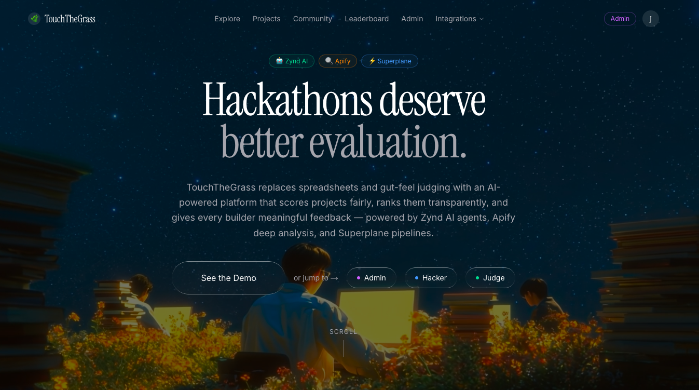
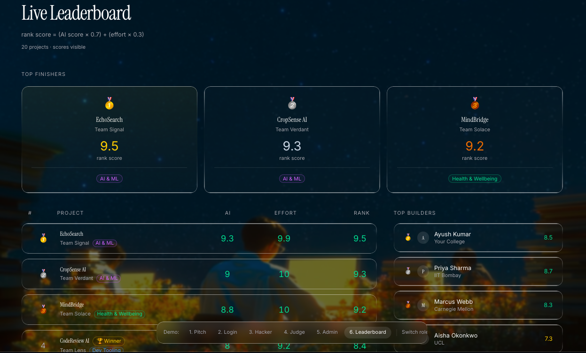
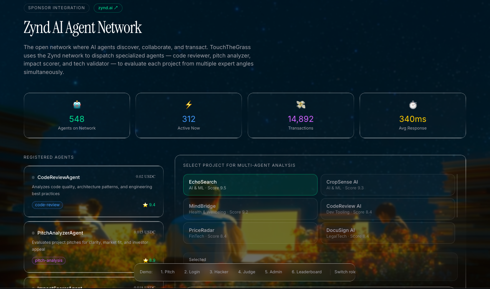
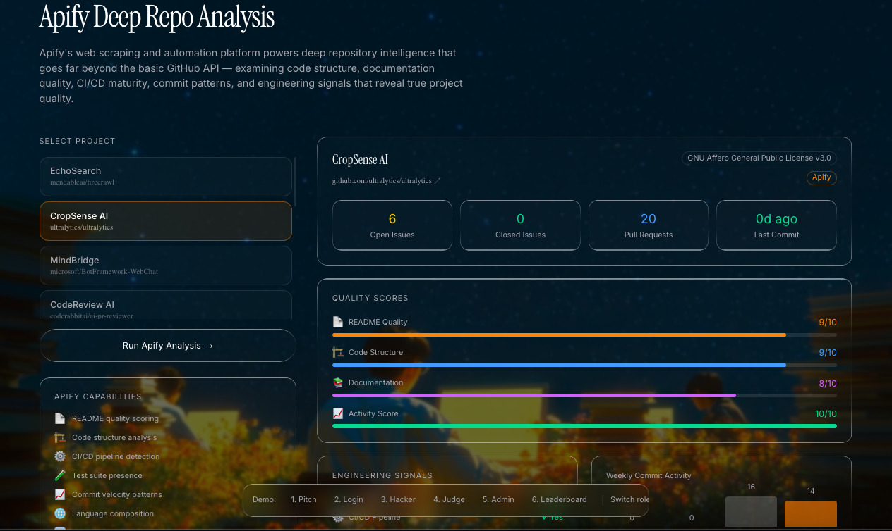
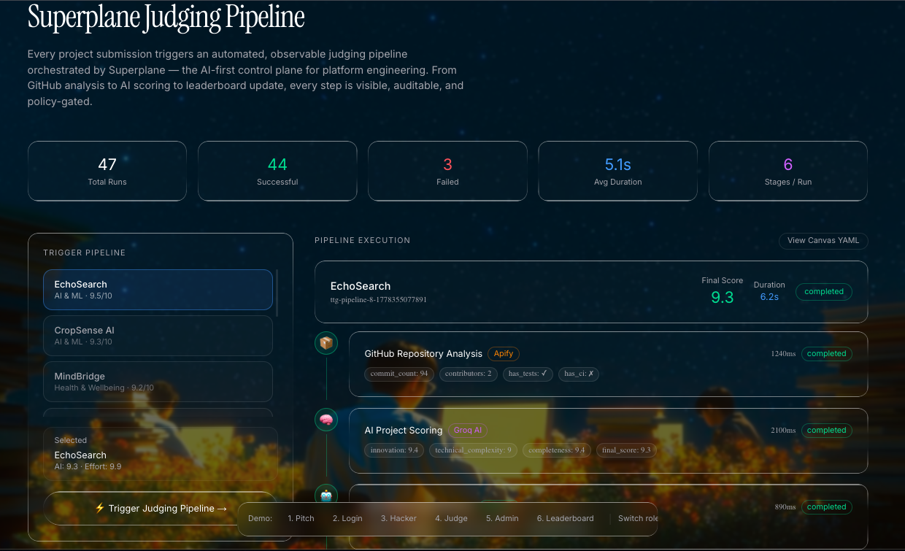
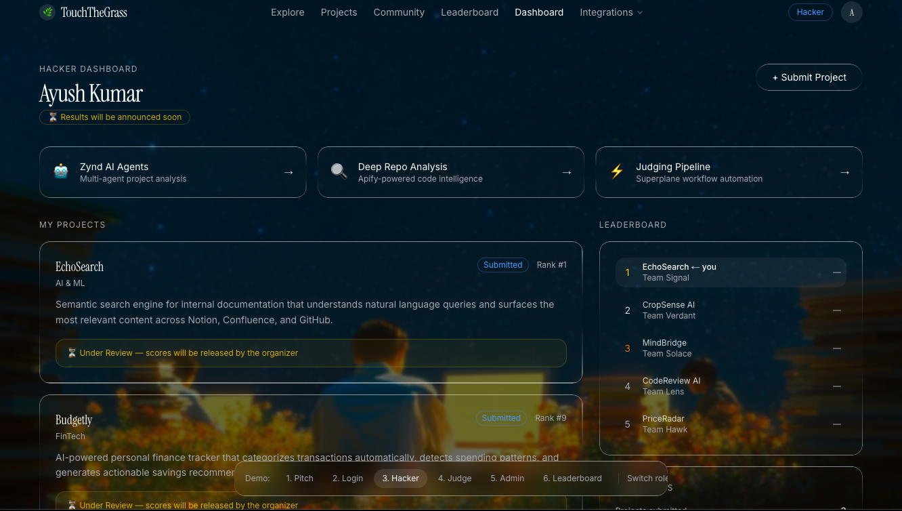

<div align="center">

# TouchTheGrass

### AI-Powered Hackathon Intelligence Platform

[](https://touch-the-grass-ntyv.vercel.app)
[](https://nextjs.org)
[](https://typescriptlang.org)
[](https://groq.com)

**Built for the Bot-to-Agent Hackathon 2026**

[🌐 Live Site](https://touch-the-grass-ntyv.vercel.app) · [🤖 Agent Network](https://touch-the-grass-ntyv.vercel.app/agents) · [🔍 Deep Analysis](https://touch-the-grass-ntyv.vercel.app/deep-analysis) · [⚡ Pipeline](https://touch-the-grass-ntyv.vercel.app/pipeline)

</div>

---

## 🌿 What is TouchTheGrass?

TouchTheGrass replaces spreadsheets and gut-feel judging with an **AI-powered hackathon platform** that scores projects fairly, ranks them transparently, and gives every builder meaningful feedback — powered by a full multi-sponsor integration stack.

> *48 hours of building reduced to a 5-minute judge glance. 60% of winners chosen by familiarity, not merit. 0 structured feedback for most hackers. We fix all three.*

---

## 📸 Screenshots

### Home Page


### Live Leaderboard


### Zynd AI Agent Network


### Apify Deep Repo Analysis


### Superplane Judging Pipeline


### Hacker Dashboard


---

## 🏆 Sponsor Track Integrations

### 🤖 Zynd AI — Open Agent Network
> **Track: Top 3 Winners · $100/$60/$40 cash + credits**

TouchTheGrass dispatches **4 specialized AI agents** from the Zynd open network to evaluate every hackathon project simultaneously:

| Agent | Capability | Trust Score |
|-------|-----------|-------------|
| `CodeReviewAgent` | Code quality, architecture, security | ⭐ 9.4 |
| `PitchAnalyzerAgent` | Pitch clarity, market fit, investor appeal | ⭐ 8.9 |
| `ImpactScorerAgent` | Real-world impact, SDG alignment, scalability | ⭐ 9.1 |
| `TechValidatorAgent` | Technical feasibility, stack validation | ⭐ 9.6 |

- Agents settle via **x402 USDC micropayments on Base Sepolia**
- **Ed25519 cryptographic identity** for every agent
- **Semantic discovery** across 548+ agents on the network
- Live transaction feed with real-time settlements


```
POST /api/zynd/discover-agents
→ 4 agents consulted · network_score: 8.5 · settled via x402
```

**Live:** [touch-the-grass-ntyv.vercel.app/agents](https://touch-the-grass-ntyv.vercel.app/agents)

---

### 🔍 Apify — Deep Repository Intelligence
> **Track: Top 5 Winners · $100 + credits**

Apify powers **deep repository analysis** that goes far beyond the basic GitHub API:

- 📄 README quality scoring
- 🏗️ Code structure & architecture analysis
- ⚙️ CI/CD pipeline detection
- 🧪 Test suite presence
- 📈 Weekly commit velocity (4-week chart)
- 🌐 Language composition breakdown
- 🔀 PR workflow analysis
- ⭐ Community engagement signals


```
POST /api/apify/analyze-repo
→ readme: 7 · code_structure: 8 · has_ci: true · languages: [Python, TypeScript]
```

**Live:** [touch-the-grass-ntyv.vercel.app/deep-analysis](https://touch-the-grass-ntyv.vercel.app/deep-analysis)

---

### ⚡ Superplane — Automated Judging Pipeline
> **Track: Top 10 Projects · Superplane Goodies**

Every project submission triggers a **6-stage event-driven judging pipeline** orchestrated by Superplane:

```
project.submitted
    │
    ▼
📦 GitHub Analysis (Apify)          ~1.2s
    │
    ▼
🧠 AI Scoring (Groq LLaMA 3.3)     ~2.1s
    │
    ▼
🤖 Zynd Multi-Agent Review          ~0.9s
    │
    ▼
💬 Feedback Generation (Groq)       ~1.8s
    │
    ▼
🏆 Leaderboard Rank Update          ~0.1s
    │
    ▼
📨 Notify Hacker                    ~0.05s
```

- Defined as **Canvas YAML** — viewable directly in the UI
- **Policy gates** for high-scoring projects (≥9.0 requires judge approval)
- **Full immutable audit trail** for every pipeline run
- 300+ integrations via Superplane's open source control plane


**Live:** [touch-the-grass-ntyv.vercel.app/pipeline](https://touch-the-grass-ntyv.vercel.app/pipeline)

---

### 🐙 GitHub Copilot — Best Use of Copilot
> **Track: $50 cash + GitHub goodies**

GitHub Copilot was used extensively throughout the development of TouchTheGrass:

- **API route handlers** — Copilot generated boilerplate for all 9 API routes including request validation, error handling, and JSON response shaping
- **TypeScript interfaces** — Copilot suggested the full `DemoProject`, `DemoHacker`, `DemoSponsor` interface definitions from partial type hints
- **Scoring algorithm** — Copilot autocompleted the seeded random scoring logic in `lib/demo/mockAI.ts` including the deterministic jitter system
- **Superplane pipeline stages** — Copilot helped write the 6-stage pipeline visualization with animated connectors and stage output badges
- **Apify fallback scoring** — Copilot suggested the `seededFloat` / `seededInt` deterministic scoring approach for private repos
- **Tailwind UI patterns** — Copilot accelerated repetitive glass card, badge, and score bar component patterns across 16 pages
- **Zynd integration** — Copilot helped structure the agent dispatch loop with sequential activation animations

Copilot's inline suggestions reduced development time significantly across the entire codebase — from data models to API integrations to UI components.

---

## ✨ Core Features

| Feature | Description |
|---------|-------------|
| **AI Project Scoring** | Groq LLaMA 3.3 evaluates innovation, complexity, and completeness |
| **Effort Detection** | Commit history + contributor balance + GitHub stars → effort score |
| **Live Leaderboard** | `rank = (AI × 0.7) + (effort × 0.3)` — formula is public |
| **Blind Judging** | Toggle to hide team names and colleges |
| **Hacker Dashboard** | Submit → get AI brief + score in under 1 second |
| **Judge Dashboard** | Review projects with AI assistance, trigger pipelines |
| **Student Analyzer** | GitHub profile → AI hiring verdict for judges |
| **Admin Control** | Toggle result visibility, manage event data |
| **Community Board** | Team formation, skill matching, post interactions |


---

## 🛠️ Tech Stack

```
Frontend          Next.js 16 · React 19 · TypeScript 5.7 · Tailwind CSS 4
AI / LLM          Groq API (LLaMA 3.3 70B Versatile)
Agent Network     Zynd AI (x402 micropayments · Ed25519 identity)
Repo Analysis     Apify + GitHub REST API
Pipeline          Superplane (Canvas YAML · event-driven workflows)
Dev Tooling       GitHub Copilot (used throughout development)
State             React Context + localStorage
Deployment        Vercel
Analytics         Vercel Analytics
```

---

## 🎭 Demo Roles

No signup required — pick a role and explore:

| Role | Access | Link |
|------|--------|------|
| **🔵 Hacker** | Submit projects, view scores, check leaderboard | [Login as Hacker](https://touch-the-grass-ntyv.vercel.app/demo-login?role=hacker) |
| **🟢 Judge** | Review projects, trigger pipelines, analyze students | [Login as Judge](https://touch-the-grass-ntyv.vercel.app/demo-login?role=judge) |
| **🟣 Admin** | Full visibility, toggle result release, manage event | [Login as Admin](https://touch-the-grass-ntyv.vercel.app/demo-login?role=admin) |

---

## 📁 Project Structure

```
touch-the-grass/
├── app/
│   ├── agents/          # Zynd AI agent network page
│   ├── deep-analysis/   # Apify deep repo analysis page
│   ├── pipeline/        # Superplane judging pipeline page
│   ├── dashboard/       # Hacker dashboard
│   ├── judging/         # Judge dashboard
│   ├── leaderboard/     # Live leaderboard
│   ├── community/       # Team formation board
│   └── api/
│       ├── ai/          # Groq scoring, feedback, briefs
│       ├── apify/       # Deep repo analysis
│       ├── zynd/        # Agent network dispatch
│       └── superplane/  # Pipeline orchestration
├── components/
│   ├── judge/           # Judge-specific components
│   ├── ui/              # Radix UI component library
│   └── navigation.tsx   # Nav with Integrations dropdown
├── lib/
│   ├── groq.ts          # Groq API client
│   ├── demo/            # Demo data + mock AI
│   └── githubAnalyzer.ts
└── contexts/            # React Context (auth + store)
```

---

## 🔌 API Reference

| Endpoint | Method | Description |
|----------|--------|-------------|
| `/api/ai/score` | POST | AI project scoring via Groq |
| `/api/ai/feedback` | POST | Constructive feedback generation |
| `/api/ai/effort` | POST | Effort score from GitHub metrics |
| `/api/ai/project-brief` | POST | Project summary generation |
| `/api/apify/analyze-repo` | POST | Deep repository analysis |
| `/api/zynd/discover-agents` | GET/POST | Zynd agent network dispatch |
| `/api/superplane/pipeline` | GET/POST | Judging pipeline orchestration |
| `/api/analyze-student` | POST | GitHub profile verdict |
| `/api/leaderboard` | GET | Ranked project list |

---

## 🏗️ Architecture

```
                    ┌─────────────────────────────┐
                    │     TouchTheGrass Platform   │
                    └──────────────┬──────────────┘
                                   │
              ┌────────────────────┼────────────────────┐
              │                    │                    │
    ┌─────────▼──────┐   ┌────────▼───────┐   ┌───────▼────────┐
    │   Groq LLaMA   │   │  Zynd AI       │   │   Superplane   │
    │   3.3 70B      │   │  Agent Network │   │   Pipeline     │
    │                │   │  548+ agents   │   │   6 stages     │
    │  • Scoring     │   │  • CodeReview  │   │  • Orchestrate │
    │  • Feedback    │   │  • PitchAnalyz │   │  • Audit trail │
    │  • Briefs      │   │  • ImpactScore │   │  • Policy gate │
    └────────────────┘   │  • TechValid   │   └────────────────┘
                         │  x402 USDC     │
                         └───────────────┘
                                   │
                    ┌──────────────▼──────────────┐
                    │         Apify               │
                    │   Deep Repo Intelligence    │
                    │  • README quality           │
                    │  • CI/CD detection          │
                    │  • Commit velocity          │
                    │  • Language composition     │
                    └─────────────────────────────┘
```

---

## 📄 License

MIT License — see [LICENSE](LICENSE) for details.

---

<div align="center">

Built with ❤️ for the **Bot-to-Agent Hackathon 2026**

[](https://zynd.ai)
[](https://apify.com)
[](https://superplane.com)
[](https://groq.com)
[](https://github.com/features/copilot)

</div>
